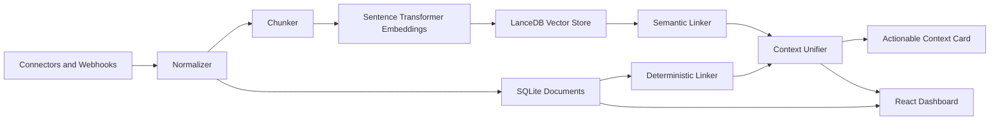

# StitchMind: AI Context Stitcher

StitchMind is a local-first AI assistant that gathers fragmented context from tools like Slack, Jira, GitHub, Gmail, and Google Docs, links related items, and presents unified, actionable Context Cards. It is designed as a zero-investment portfolio project: local storage, local embeddings, optional Ollama, and optional hosted LLM support.

## What It Solves

Modern work leaves context scattered across tickets, pull requests, chat threads, emails, and documents. StitchMind reduces the manual effort of reconstructing that story by showing:

- What happened
- Which sources are connected
- What evidence supports the conclusion
- What risks or open questions remain
- What action should happen next

## Demo Workflows

The sandbox seed creates three complete cross-platform examples:

- **Bug tracking:** Jira `PROJ-101`, Slack investigation, GitHub PR `#202`, and architecture doc.
- **Project planning:** Jira `PLAN-42`, Google launch plan, Gmail owner thread, and GitHub PR `#88`.
- **Personal trip planning:** Google itinerary `TRIP-2026`, Gmail flight/hotel confirmations, and chat reminders.

## Architecture



Core pipeline:

1. Connectors fetch or receive platform data.
2. Normalizer maps every source into a shared `Document` shape.
3. Chunker and local embeddings index long content in LanceDB.
4. Deterministic linker connects Jira keys, PR references, URLs, and branch mentions.
5. Semantic linker adds graph edges for close vector neighbors.
6. Context unifier returns a strict card shape with summary, timeline, evidence, questions, risks, anomalies, and suggested actions.

## Tech Stack

- **Backend:** FastAPI, Uvicorn, Pydantic, SQLAlchemy
- **Frontend:** React, Vite, TypeScript, CSS Modules, Lucide icons
- **Local storage:** SQLite for metadata, LanceDB for vectors
- **AI:** Sentence Transformers for embeddings, LiteLLM for Gemini/Ollama switching
- **Privacy:** encrypted connector configs, local data reset, no telemetry

## API Surface

- `GET /api/health`
- `GET /api/config`
- `POST /api/config`
- `GET /api/connectors`
- `POST /api/connectors`
- `DELETE /api/connectors/{connector_id}`
- `POST /api/connectors/{connector_id}/sync`
- `POST /api/webhooks/{platform}`
- `GET /api/documents`
- `GET /api/documents/{doc_id}`
- `GET /api/documents/{doc_id}/stitch`
- `GET /api/links`
- `POST /api/seed-mock-data`
- `DELETE /api/privacy/local-data`

## Local Setup

Prerequisites:

- Python 3.10+
- Node.js 18+
- npm

Start the app on Windows:

```powershell
.\start-stitchmind.ps1
```

Manual startup:

```powershell
cd backend
.\venv\Scripts\python.exe run.py
```

```powershell
cd frontend
npm run dev
```

Open:

- Web UI: `http://localhost:5173`
- API docs: `http://localhost:8000/docs`

## Usage

1. Open the Connectors page.
2. Click **Seed Sandbox Data**.
3. Return to the Dashboard and choose any seeded item.
4. Click **Stitch Context** to generate a Context Card.
5. Open the Graph page to inspect cross-platform relationships.
6. Use **Delete Local Data** to clear local documents, links, connectors, and vector chunks.

## Security And Privacy

- Data lives under `backend/data` by default.
- Connector credentials are encrypted before storage.
- `.env`, local databases, vector stores, and Google credential files are ignored.
- The app works without cloud hosting or telemetry.
- Suggested actions are drafts and are not auto-posted to external systems.

## Integration Roadmap

- GitHub REST ingestion for issues, PRs, commits, labels, and comments.
- Slack channel and thread grouping through Slack Web API.
- Jira Cloud issue and comment sync.
- Gmail and Google Docs read-only OAuth desktop flow.
- Webhook ingestion for incremental events.
- Markdown export for generated Context Cards.
- Proactive daily briefs for stale tickets, unresolved PRs, unanswered questions, and status mismatches.
- Optional voice query and spoken card summaries.

## Resume Highlights

- Local-first AI/RAG system using SQLite, LanceDB, Sentence Transformers, and optional LLM providers.
- Cross-platform entity linking with deterministic rules and vector similarity.
- Practical privacy posture with encrypted configs and local deletion controls.
- Full-stack TypeScript/Python portfolio app with seeded workflows that demo in minutes.
